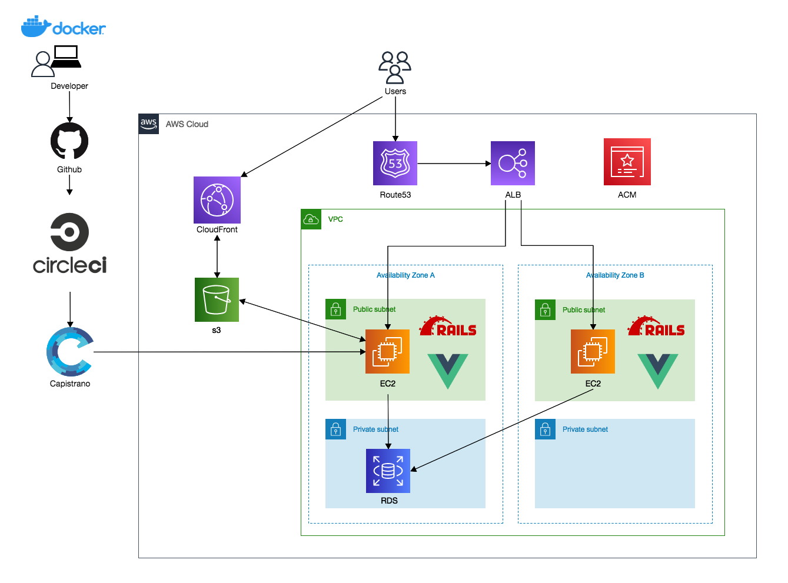
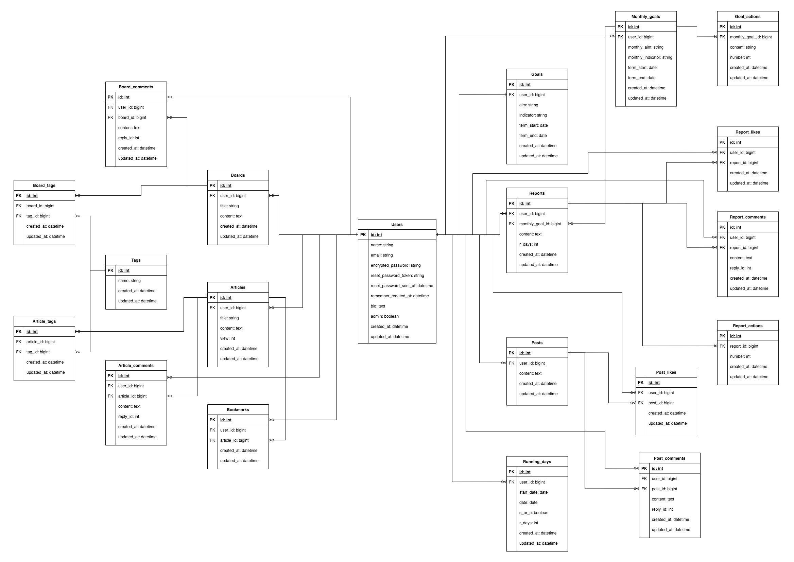

# Progress
アプリ: [https://progress-start.com](https://progress-start.com)

## 概要

継続できないを解消する横の繋がりを活かした目標達成アプリです

## 制作背景

大学3年生の時から２年ほど英会話スクールの事業に携わっていました。
その事業を行っていく過程（営業やサポートなど）で
たくさんのお客さんの悩みやつまづくポイントを目の当たりにしてきました。

みんなが口を揃えて言う悩みが
- 継続できない
- モチベでない
- 目標忘れる
- 外国人に会う機会、会話する機会が作りにくい
- 単語が覚えられない
- どんな教材がいいか分からない

といったもので、その中でも特に

- 継続できない
- モチベでない
- 目標忘れる

この３つに関しては本当によく出てくる悩みで非常に重要な課題でした。

そのため、この問題をより解決しやすくしてくれる
当時あったら良かったサービスを実現できたらと思い

みんなの目標、進捗、その日やったこと、困っていること、
有益な情報を共有でき刺激がもらえるアプリを開発しようと考えました。

## 使用技術

* フロントエンド
  - HTML/CSS(Sass)
  - Bootstrap 4.5.0
  - jQuery
  - Vue.js（部分SPA化）

* バックエンド
  - Ruby 2.7.3
  - Ruby on Rails 6.1.3.2
  - MySQL 8.0.25
  - Rubocop（コード解析ツール）
  - RSpec(テスト)
  
* インフラ
  - AWS(VPC / EC2 / Route53 / S3 / RDS / ACM / ALB / IAM)
  - Nginx
  - Puma
  - Capistrano
  - CircleCI(CI/CD)
  
* 開発環境
  - cloud9 (macbookのストレージ容量が十分にないため、ローカル環境ではなくAWSのCloud IDEを使っています)
  - Docker/Docker-compose
 
## 工夫した点
* マイページの部分SPA化
* 日報の投稿と継続日数の連動（投稿が途切れると1日目に戻る）
* 達成したアクションの数値化、グラフ化
* カレンダーに達成日の表示、締切日を表示
* 月/週/日ごとの目標/達成数値の算出
* 日報にアクションと1日あたりに換算した数値の表示
* 日報の投稿日　（0時を過ぎると次の日扱いになってしまうので、深夜２時まで当日扱いにした）
* Vueインスタンスを機能毎にマウントしてモジュール単位で管理できるようにしたこと
* 大規模なプロジェクトに備えた練習としてVuexでデータを管理したこと  
 
## インフラ構成図

## ER図

## 機能一覧

* ユーザー機能(Users)
  - ユーザー新規登録/編集/削除
  - ログイン/ログアウト/ゲストログイン/Twitter, Google OmniAuth
  - ログイン状態記憶
  - パスワード再設定
  - マイページ（ユーザーのステータス、目標、つぶやき、日報等が見れる）
  - 目標(長期/今月)のタブ切り替え表示
  - 目標の期間、残り日数表示
  - カレンダー機能
  - 達成済表示機能
  - 目標締切日表示機能
  - アクション進捗度表示（月間、週間、日間）
  - 最新のつぶやき表示機能
  - 達成度、実績機能（グラフ）
  - アバター登録/編集/削除
  - いいねしたつぶやき/日報表示機能
  - いいね(axios)

* 長期目標機能(Goal)
  - 作成(ユーザー作成時に一緒に生成)/編集

* 月間目標機能(Montly_goals)
  - 作成/編集/削除
  - 月間アクション追加/ 削除

* 日報機能(Reports)
  - 投稿/編集/削除
  - 画像複数登録
  - 1ヶ月の目標/目的/アクション表示
  - 1日あたりの目標アクション数表示
  - 継続日数表示
  - 投稿日時表示
  - コメント
  - いいね
  - ページネーション

* つぶやき機能(Posts)
  - 投稿/編集/削除
  - 画像複数登録
  - 投稿日時表示
  - コメント
  - いいね
  - ページネーション

* 悩み掲示板機能(Boards)
  - 投稿/編集/削除
  - 投稿日時表示
  - コメント
  - タグ
  - 検索
  - 状態表示
  - ページネーション

* 勉強法特集機能(ブログ) (Articles)
  - 投稿/編集/削除
  - 人気記事表示(閲覧数で順位付け)
  - ブックマーク
  - 画像登録
  - コメント
  - タグ
  - 検索
  - ページネーション

* その他
  - みんなの目標機能（いろんなユーザーの長期/月間目標表示）
  - ランキング機能
  - ハンバーガーメニュー
  - レスポンシブ
  - i18n日本語化